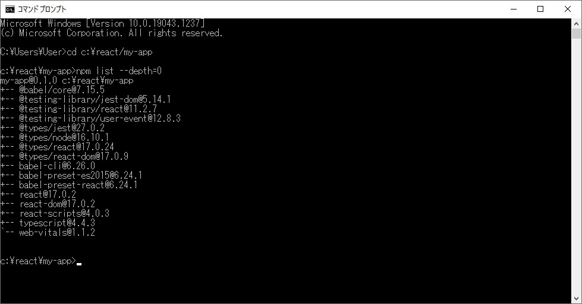

# test

<table>
  <tbody>
    <tr>
      <td colspan="2">
        MAMPスタートパネル 
        
      </td>
    </tr>
    <tr>
      <td colspan="2">
        Node.jsバージョン情報 
        
      </td>
    </tr>
    <tr>
      <td>
        React.jsバージョン情報 
        
      </td>
      <td>
        React.jsサンプル 
        
      </td>
    </tr>
    <tr>
      <td>
        Gitバージョン情報 
        
      </td>
      <td>
        GitHub動作画面 
        
      </td>
    </tr>
  </tbody>
</table>
